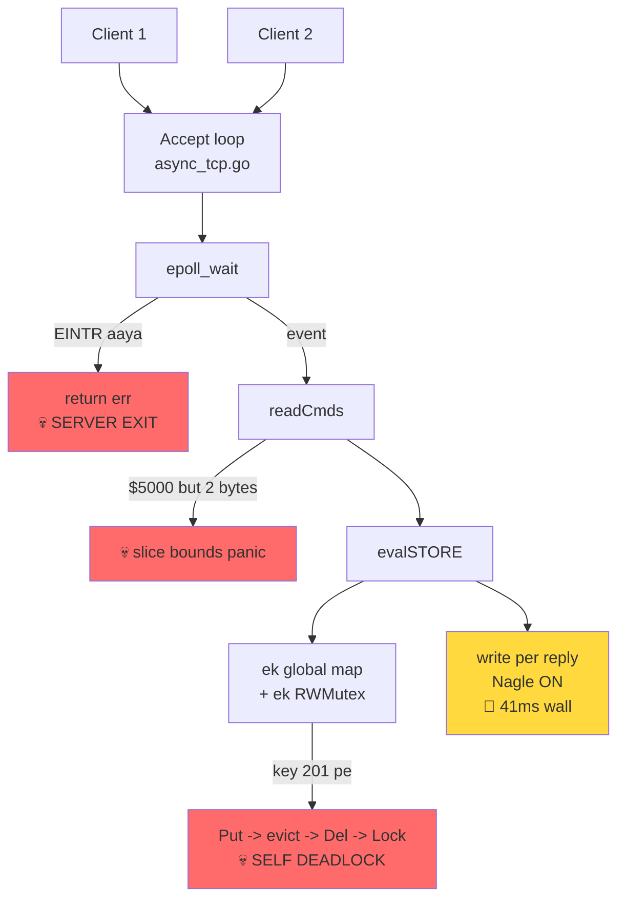
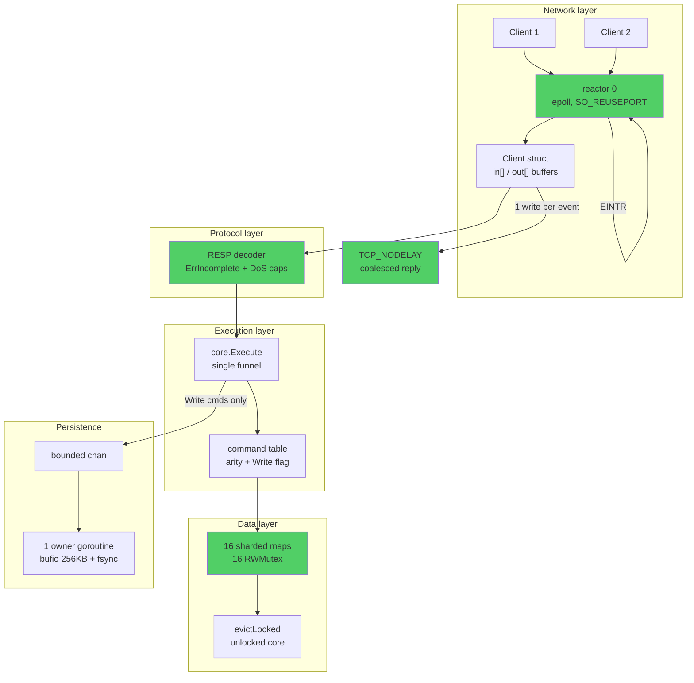
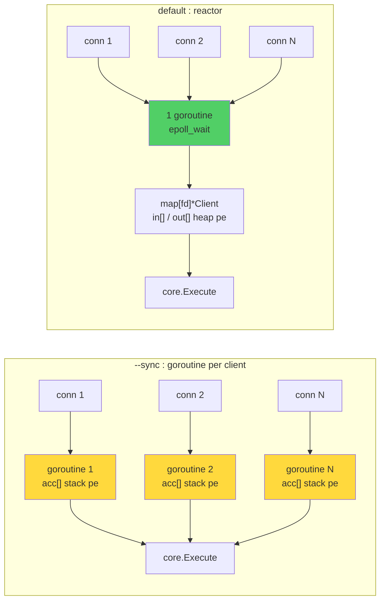
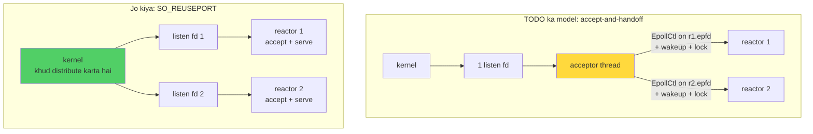
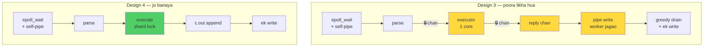

# HARDENING.md

**`main` se `feat/mvp-hardening` tak — poori kahani, first principles se.**

> Yeh doc parts mein likha ja raha hai. Har part chat mein bhi diya gaya hai.
> Progress: **Part 1 / ~18 done**

---

## Part 1 — Roadmap aur TL;DR

### Yeh doc kya hai

`main` branch pe tera Redis clone ka **pehla working draft** tha. `feat/mvp-hardening` pe wahi cheez **production-shaped** ho gayi. Diff: **46 files, +9760 / −857**.

Yeh doc har change ko 4 lens se dekhega:

- **Code POV** — exact lines, before/after
- **Architecture POV** — design kyun aisa hai
- **Performance POV** — kitna farak pada, naapa hua
- **Interview POV** — isse kaunsa sawaal answer ho jaata hai

Aur har change pe do sawaal hamesha: **"first principles pe yeh kyun kiya?"** aur **"agar yeh nahi karte to kya hota?"**

### Ek line mein: kya hua

`main` ka server **teen tarah se mar jaata tha** (crash, hang, panic), **41ms ka latency wall** tha, aur **do data race** the. Hardening branch ne woh sab theek kiya, phir uske neeche 99 tests daal diye taaki dobara na aaye.

### Before / After — naapa hua (same machine, 8 CPU, sequential runs)

| workload | `main` (`GODEBUG=asyncpreemptoff=1` ke bina chalta hi nahi) | `feat/mvp-hardening` (default runtime) | real Redis 8.8.0 | hardened vs Redis |
|---|---|---|---|---|
| SET, no pipeline | 75,757 rps | **139,470 rps** | 149,031 rps | 0.94× |
| GET, no pipeline | 88,495 rps | **140,647 rps** | 117,096 rps | **1.20×** |
| SET, `-P 8` | 1,948 rps | **467,289 rps** | 813,008 rps | 0.57× |
| GET, `-P 8` | 1,949 rps | **900,900 rps** | 943,396 rps | 0.96× |
| SET, `-P 64` | **💀 crash** | **1,041,666 rps** | 1,459,854 rps | 0.71× |
| GET, `-P 64` | **💀 crash** | **1,680,672 rps** | 1,960,784 rps | 0.86× |

Do cheezein notice kar:

1. **`-P 8` pe 240×–462× improvement.** 1,948 → 467,289. Yeh koi micro-optimization nahi hai — yeh ek **bug** tha jo throughput ko floor pe pin kar raha tha (Nagle × delayed-ACK, Part 4 mein).
2. **GET no-pipeline pe hum real Redis se tez hain (1.20×).** Kyunki ek reactor + sharded map, aur Redis single-threaded hai. Yeh brag nahi hai — yeh sirf batata hai ki architecture theek hai.

> **Honesty note:** `main` ke numbers `bench/phase0_raw.txt` se hain (n=10,000). Hardened aur Redis ke numbers abhi liye gaye (n=100,000 / 200,000). Chhota n = zyada variance, to depth-1 ke numbers ko ±10% samajh.

### Poora picture — before



Teen laal box = teen alag tareeke se server marta tha. Ek peela box = performance floor.

### Poora picture — after



### Kaunse layer bane

| Layer | File | Pehle kya tha |
|---|---|---|
| Config | `config/config.go` | `config/main.go`, 4 knob, koi rationale nahi |
| Network | `server/async_tcp.go`, `server/client.go` | ek file, per-connection state hi nahi tha |
| Protocol | `core/resp.go` | tha, par unsafe |
| Dispatch | `core/cmd.go`, `core/eval.go` | ek giant `switch` |
| Data | `core/store.go`, `core/object.go`, `core/eviction.go`, `core/expire.go` | ek global map |
| Persistence | `core/aof.go`, `core/aof_rewrite.go` | snapshot dump, log nahi |
| Commands | `core/cmd_string.go`, `core/cmd_keys.go`, `core/cmd_server.go` | 8 commands, ab ~35 |
| Tests | 8 test files, ~99 tests | **zero** |

### Aage ka plan (parts)

```
Part 2   First principles — ek Redis server actually kya hai + RESP zero se
Part 3   💀 Bug 1: EINTR / SIGURG — server 14 commands mein mar jaata tha
Part 4   🐌 Bug 2: Nagle x delayed-ACK — 41ms ka wall
Part 5   💀 Bug 3: eviction self-deadlock — reentrancy aur "locked shell, unlocked core"
Part 6   💀 Bug 4: RESP bounds panic — 13 byte bhejo, server gir jaaye
Part 7   🐞 Bug 5+6: INCR lost update, aur Get ka write lock
Part 8   🐞 Bug 7+8+9: sync server 1 client, inert flags, glob exponential blowup
Part 9   Architecture: sharded store deep dive
Part 10  Architecture: reactor model deep dive
Part 11  Architecture: AOF ko real append-only log banana
Part 12  Architecture: command table, object encoding, expiry, graceful shutdown
Part 13  Performance: numbers ka breakdown, bacha hua gap kahan hai
Part 14  Tests ZERO se — Go test kaise kaam karta hai
Part 15  Tests: unit tests walkthrough
Part 16  Tests: fuzzing + race detector
Part 17  Tests: integration tests (real sockets, SIGURG storm, Nagle threshold)
Part 18  Interview POV: sawaal-jawaab
```

---

## Part 1A — Interlude: "ek client = ek goroutine" kiya ya nahi?

Haan aur nahi — **do server hain aur dono ne ulta rasta liya.** Yeh sabse important architectural decision hai is repo mein.

### Sync server (`--sync`): haan, exactly ek client = ek goroutine

`main` pe yeh line **literally comment mein padi thi**:

```go
// server/sync_tcp.go on main
for {
    c, err := lsnr.Accept()
    ...
    for {                          // <-- read/respond loop INLINE
        cmd, err := readCmds(c)
        respond(c, cmd)
    }
    // go handle(c)                // <-- 💀 commented out
}
```

Matlab: accept ke baad server usi client ke andar `for` loop mein ghus jaata tha. **Doosra client accept queue mein baitha rehta tha jab tak pehla disconnect na ho.** Ek client at a time.

Hardening mein `go` un-comment hua, plus shutdown ke liye bookkeeping:

```go
// server/sync_tcp.go on feat/mvp-hardening
s.conns[c] = struct{}{}
s.mu.Unlock()

// The go statement is the whole point. The original ran this inline, so
// the server handled exactly one client at a time and the second
// connection sat in the accept queue until the first disconnected.
s.wg.Add(1)
go func() {
    defer s.wg.Done()
    defer func() { s.mu.Lock(); delete(s.conns, c); s.mu.Unlock() }()
    handleSyncConn(c)
}()
```

`wg` + `conns` map isliye hain ki `Shutdown()` listener band kare, saare conn close kare, aur `wg.Wait()` se in-flight commands ko finish hone de — warna graceful shutdown jhooth hota.

### Async/epoll server (default): jaan-boojh kar **nahi** kiya

`main` pe do TODO the, `server/async_tcp.go:73` aur `:84`:

```go
//todo
//assigne this new client to an seprate IO thread
...
///todo
//same I/O thread for read cmd
```

Hardening ne yeh TODO **goroutine-per-client se nahi, reactor model se** resolve kiya. N goroutine (default `NumReactors = 1`), har goroutine ke paas apna epoll set aur apna client map:

```go
type reactor struct {
    id       int
    listenFd int
    epfd     int
    clients  map[int]*Client       // ek goroutine, hazaar clients
    events   []syscall.EpollEvent
    scratch  *scratch
    srv      *Server
}

// Server.Run -- goroutine PER REACTOR, not per client
for i, r := range s.reactors {
    s.wg.Add(1)
    go func(i int, r *reactor) { defer s.wg.Done(); errs[i] = r.loop() }(i, r)
}
```

### Asli insight — yeh sirf style ka farak nahi hai

Goroutine-per-client mein **per-connection state goroutine ke stack pe rehta hai** — woh `for` loop ka local `acc []byte`. Tu us goroutine ka stack hi state ki tarah use kar raha hai.

Reactor model mein stack **nahi hota**, kyunki goroutine do event ke beech `epoll_wait` pe wapas chala jaata hai. To state ko **explicitly** kahin rakhna padega. Isi liye `server/client.go` ek naya file hai:

```go
type Client struct {
    Fd int
    in  []byte   // bytes aaye par poora command nahi bana
    out []byte   // replies jo abhi kernel ko nahi diye
    closed bool
}
```

Yeh struct literally wahi cheez hai jo goroutine ka stack hold karta. **`client.go` ka existence hi reactor model ka lagaan hai.**



### Trade-off, numbers ke saath

Goroutine ka minimum stack 8KB hai. 10,000 connection = ~80MB stacks + scheduler ka kaam + Go netpoller andar se epoll hi chala raha hai (ek extra layer). Redis ne 1 thread + epoll chuna; humne default wahi rakha (`NumReactors = 1`), aur goroutine-per-conn wala rasta `--sync` ke peeche rakh diya — comparison ke liye aur simplicity ke liye.

### Poore process mein kitne goroutine hain (hardening, default mode)

| goroutine | kitne | kaam |
|---|---|---|
| reactor | `NumReactors` (default 1) | epoll_wait, accept, read, execute, write |
| AOF `writeLoop` | 1 | AOF fd ka **single owner** — share-nothing |
| active expiry | 1 | har 100ms sample-and-delete sweep |
| signal handler | 1 | SIGINT/SIGTERM -> `srv.Shutdown()` |
| pprof HTTP | 0 ya kuch | sirf `--pprof` pe |
| per-connection | **0** | default mode mein zero. `--sync` mein 1 per conn. |

### Interview POV

"Goroutine per connection vs event loop" classic sawaal hai. Sahi jawaab yeh nahi ki kaunsa better hai — sahi jawaab hai **"per-connection state kahan store hoga"**. Goroutine model mein compiler tumhare liye store karta hai (stack), reactor model mein tumhe khud struct banana padta hai. Baaki sab (memory footprint, scheduler cost, cache locality) usi ek baat ka natija hai.

Follow-up jo poocha jaata hai: *"to Go mein event loop kyun likhoge jab netpoller already hai?"* — jawaab: production mein nahi likhoge. Yahan likha hai kyunki (a) Redis ka model exactly yahi hai aur usse match karna tha, (b) `SO_REUSEPORT` + N reactor se tu manually control kar sakta hai ki kitne OS thread network handle karein, (c) reply coalescing (Part 4) reactor model mein natural hai — ek event = ek `write()`.

---

## Part 1B — "TODO mein toh maine goroutine-per-conn already rule out kar diya tha, yeh usse alag kaise?"

Pehle ek baat maan lete hain: **TODO mein direction sahi tha.** "IO thread" likhna hi batata hai ki goroutine-per-conn nahi, fixed reactor pool socha ja raha tha. Idea naya nahi hai. Farak yeh hai ki TODO likhna aur TODO implement kar paana do alag cheez hai — aur `main` ke code pe woh TODO **implement hi nahi ho sakta tha**.

### 1. TODO ne destination likha tha, machinery zero thi

`main` pe do TODO the:

```go
//assigne this new client to an seprate IO thread     // <- N reactors chahiye
///same I/O thread for read cmd                        // <- thread affinity chahiye
```

Dono sahi. Par implement karne ke liye teen cheezein missing thi:

| TODO ko kya chahiye | `main` mein kya tha |
|---|---|
| N epoll sets (ek per IO thread) | **ek** `epfd`, `RunAsyncTCP()` ka local variable |
| Per-client state jo affine rakha jaaye | **kuch bhi nahi** — `core.FDComm{Fd: int(events[i].Fd)}` har event pe **fresh banta tha** |
| Per-thread event array | `var events = make([]syscall.EpollEvent, 20_000)` — **package-level, shared** |

Teesra point sabse mazedaar hai: `events` package-level tha. Agar `go` laga ke doosra IO thread bana dete, dono goroutine **usi ek slice mein** `EpollWait` likhwate -> instant data race, `-race` turant chillata.

### 2. Affinity ka matlab hi nahi banta jab state hi na ho

`FDComm` poora yeh hai:

```go
type FDComm struct { Fd int }
func (f *FDComm) Read(b []byte) (int, error)  { return syscall.Read(f.Fd, b) }
func (f *FDComm) Write(b []byte) (int, error) { return syscall.Write(f.Fd, b) }
```

Sirf ek `int`. Koi buffer nahi. Aur woh **har event pe naya banta tha**.

"Same IO thread for read cmd" ka **maqsad** yeh hota hai ki client ka half-read command doosre thread ko na dikhe. Par `main` mein half-read command **kahin store hi nahi hota tha** — `readCmds` ek 512-byte stack buffer pe ek `read()` maarta tha aur leftover phenk deta tha. To affinity kis cheez ko protect karti? Kuch bhi nahi. **TODO ek aisi cheez ki raksha kar raha tha jo exist nahi karti thi.**

Isi liye asli kaam yeh tha:

```go
// server/client.go -- pehle yeh file hi nahi thi
type Client struct {
    Fd     int
    in     []byte   // adhoora command yahan zinda rehta hai
    out    []byte   // reply jo kernel ne abhi nahi liya
    closed bool
}
```

Aur phir affinity **comment nahi, type-level guarantee** ban gayi:

```go
type reactor struct {
    id      int
    epfd    int                  // <- apna epoll set
    clients map[int]*Client      // <- apne clients, kisi aur reactor ki pahunch se bahar
    events  []syscall.EpollEvent // <- apna array, shared nahi
    scratch *scratch             // <- apna read buffer
}
```

`clients` map reactor ke **andar** hai. Doosra reactor us `*Client` tak **pahunch hi nahi sakta** — compile-time pe. "Same IO thread for read cmd" ab ek TODO nahi, ek **invariant** hai jise todna mushkil hai.

Bonus jo affinity se free mila: `scratch` — ek read buffer **per reactor**, per read nahi. Reactor single-threaded hai, to woh ek hi buffer apne saare clients ke liye reuse kar sakta hai. Yeh optimization affinity ke bina illegal hoti.

### 3. Aur assignment ka tareeka TODO se ulta hai

TODO kehta hai: *"assign this **new** client to a separate IO thread"* — matlab ek thread accept kare, phir fd doosre ko de de. Yeh **accept-and-handoff** model hai. Iski problem:

- accepting thread ko target reactor ke `epfd` pe `EpollCtl` karna padega (cross-thread)
- target reactor `EpollWait(-1)` mein blocked hai — usse jagana padega (wakeup mechanism)
- load balancing khud likhna padega (round-robin? least-loaded?)
- `clients` map do thread se touch hoga -> lock

Hardening ne yeh poora rasta chhod diya. `SO_REUSEPORT` use kiya:

```go
// server/async_tcp.go
const soReusePort = 15   // hardcoded: x/sys dependency nahi hai repo mein
```

Har reactor apna **alag listening socket** kholta hai **usi port pe**, aur **kernel** decide karta hai ki naya connection kis socket ko jaayega. Client ko wahi reactor accept karta hai jo usse serve karega. **Koi handoff nahi, koi cross-thread `EpollCtl` nahi, koi lock nahi, koi balancing code nahi.**



**Agar `SO_REUSEPORT` na hota to kya hota:** ek shared listen fd ko N epoll sets mein daalte, to har naye connection pe **saare N reactor jaag jaate**, ek `accept4` jeetta, baaki N-1 ko `EAGAIN` milta. Yeh **thundering herd** hai — CPU jalta hai bina kaam ke. Yeh classic C10K problem ka hissa hai aur `SO_REUSEPORT` (Linux 3.9) exactly isi ke liye aaya tha.

### 4. Honest disclosure — default abhi bhi 1 reactor hai

```go
NumReactors = 1   // config/config.go; --reactors 0 = runtime.NumCPU()
```

Multi-reactor **available** hai, **default nahi**. Kyun? Kyunki sharded store + coalesced writes ke saath **ek** reactor already real Redis se aage hai GET pe (140,647 vs 117,096 rps). Zyada reactor = zyada shard-lock contention + AOF channel contention, aur win automatic nahi hai. Yeh naapa hua faisla hai, aalas nahi.

### Seedha jawaab

TODO ne goroutine-per-conn ko rule out kiya tha, sahi kiya tha. Par TODO ke neeche jo chaar cheezein chahiye thi — per-client state type, per-reactor epoll+events+scratch, affinity ka type-level enforcement, aur kernel-level distribution — woh chaaron `main` pe nahi thi.

**Naya yeh nahi hai ki *kya* karna hai; naya yeh hai ki *kar paane layak neenv* ban gayi.**

### Interview POV

Agar koi poochta hai *"tumne apne notes mein design likh diya tha, to kaam kya bacha?"* — yeh best possible jawaab hai: design ek line hai, uska **enabling state** dus files hai. Aur ek strong signal: jab affinity ko `map[int]*Client` reactor ke andar rakh ke type system se enforce kar diya, to woh design decision **document karne ki zaroorat hi nahi rahi** — code khud bolta hai. "Comment ki jagah invariant" — yeh senior-level move hai.

---

## Part 2 — Design ground up: teen kaam, kaun karega?

### Sabse pehle: server ko sirf teen kaam karne hain

```
1. I/O      -- socket se bytes padho, socket pe bytes likho   (syscall, slow)
2. PARSE    -- bytes ko command mein badlo                     (CPU, fast)
3. EXECUTE  -- store ko chhoo ke reply banao                   (memory, fast)
```

Bas. Poora design sawaal sirf ek hai: **yeh teen kaam kitni goroutine mein baantoge?**

Chaar possible jawaab hain.

### Design 1 -- sab kuch ek goroutine, saare clients

Yeh `main` ka `async_tcp.go` hai:

```go
for {
    n, _ := syscall.EpollWait(epfd, events, -1)
    for i := 0; i < n; i++ {
        comm := core.FDComm{Fd: int(events[i].Fd)}
        cmds, _ := readCmds(&comm)     // I/O + PARSE
        respond(&comm, cmds)           // EXECUTE + I/O
    }
}
```

**Fayda:** simplest. Koi lock nahi, koi race nahi.
**Nuksaan:** ek core. Aur `main` mein iske saath ek bug tha -- per-client buffer nahi tha, to adha command aaya to woh gum ho gaya.

### Design 2 -- ek connection = ek goroutine

Yeh `main` ka `sync_tcp.go` hai (par `go` comment mein tha):

```go
for {
    c, _ := lsnr.Accept()
    go handleConn(c)          // I/O + PARSE + EXECUTE, sab yahan
}
```

**Fayda:** likhne mein sabse aasan. Har connection ka state stack pe (`acc []byte`).
**Nuksaan:** 10,000 conn = 10,000 goroutine x 8KB stack = 80MB. Aur store pe sab ek saath aayenge -> lock chahiye.

### Design 3 -- IO worker + channel + 1 executor

```go
type Job struct {
    cmd    *core.RedisCmd
    client *Client
}

var jobs = make(chan Job, 65536)

func ioWorker(mereClients []*Client) {
    // I/O + PARSE  ->  channel
}

func executor() {
    for job := range jobs {
        reply := execute(job.cmd)     // EXECUTE -- store lock-free
        job.client.replies <- reply   // reply wapas uske owner ko
    }
}
```

### Design 4 -- jo banaya: N reactor, sab kuch reactor pe

```go
func (r *reactor) loop() {
    for {
        n, _ := syscall.EpollWait(r.epfd, r.events, -1)
        for i := 0; i < n; i++ {
            c := r.clients[int(r.events[i].Fd)]
            c.Read(r.scratch)                 // I/O
            for _, cmd := range c.ParseCommands() {   // PARSE
                c.Write(core.Execute(cmd))    // EXECUTE
            }
            c.Flush()                         // I/O
        }
    }
}
```

### Ab asli baat -- Design 3 ko end tak follow karo

Sahi baat: reply wahi IO goroutine likhega jiska woh connection hai -- **goroutine affinity**. Yeh standard solution hai (Netty, Redis 6 -- dono yahi karte hain). Chalo `ioWorker` ka andar likhte hain:

```go
func ioWorker(mereClients []*Client) {   // 1250 clients
    for {
        // ??? yahan kya likhun ???
    }
}
```

Ruk. **Ek goroutine ke paas 1250 connection hain. Usko kaise pata chalega ki kaunsa readable hai?**

Blocking `read()` nahi kar sakta -- client 1 pe block ho gaya to client 2 ka command 10 second wait karega. To usko **multiplex** karna padega:

```go
func ioWorker(mereClients []*Client) {
    epfd, _ := syscall.EpollCreate1(0)      // <- epoll AA GAYA
    for _, c := range mereClients {
        syscall.EpollCtl(epfd, syscall.EPOLL_CTL_ADD, c.fd, ...)
    }
    for {
        n, _ := syscall.EpollWait(epfd, events, -1)   // <- wahi loop
        ...
    }
}
```

**Design 3 mein bhi epoll chahiye hi chahiye.** Aur ab ek naya problem:

```go
syscall.EpollWait(epfd, events, -1)   // -1 = anant tak so jao
```

Worker so gaya hai socket ka wait karte hue. **Executor ne reply bhej di `c.replies` channel mein. Worker ko kaun jagayega?**

`epoll` ek Go channel ko **watch nahi kar sakta** -- channel Go runtime ki cheez hai, kernel ki nahi.

**Rasta A -- timeout daal do:**

```go
syscall.EpollWait(epfd, events, 1)   // 1ms timeout
select {
case r := <-someClient.replies: ...
default:
}
```

Har reply pe 1ms tak extra latency. Hamara p50 poora **0.039ms** hai. Yeh 25x kharab kar dega.

**Rasta B -- self-pipe:**

```go
pipeR, pipeW := pipe2()
syscall.EpollCtl(epfd, EPOLL_CTL_ADD, pipeR, ...)  // pipe ko bhi watch karo

// executor, reply bhejne ke baad
job.client.replies <- reply
syscall.Write(worker.pipeW, []byte{0})   // <- worker ko jagao
```

Yeh kaam karta hai. Aur mazak ki baat -- **yeh exact trick hardening code mein already hai**, shutdown ke liye:

```go
// server/async_tcp.go
type reactor struct {
    wakeFd    int   // pipe ka read end, epoll set mein
    wakeWrite int   // isme ek byte likho, EpollWait turant wapas aa jaata hai
    ...
}
```

### To Design 3 ban ke kya nikla

```
Design 3, poora likha hua =
      epoll per worker          (Design 4 mein already hai)
    + per-client in[]/out[]     (Design 4 mein already hai)
    + self-pipe                 (Design 4 mein already hai)
    + jobs channel              (EXTRA)
    + reply channel per client  (EXTRA)
    + executor goroutine        (EXTRA)
```

**Design 3 = Design 4 + ek channel + ek goroutine hop.**



Aur reply coalescing Design 3 mein bhi **bach jaata hai**, agar greedy drain karo:

```go
var batch []byte
for {
    select {
    case r := <-c.replies: batch = append(batch, r...)
    default: goto flush
    }
}
flush:
syscall.Write(c.fd, batch)   // ek write, coalescing zinda
```

To woh problem solvable hai. Baaki teen nahi.

### Woh extra channel kya deta hai, kya leta hai

| | deta hai | leta hai |
|---|---|---|
| Store lock | **zero lock** | -- |
| Deadlock | **assambhav** -- `Put->evict->Del` bug hi na hota | -- |
| `MULTI`/`EXEC`/`WATCH`/Lua | **almost free** | -- |
| `RENAME` cross-key atomic | **haan** | -- |
| Throughput | -- | **1 core ka hard ceiling** |
| Latency | -- | 2 channel op + 2 goroutine wakeup per command |
| Code | -- | +1 goroutine, +2 channel, +wakeup ka rasta |

Naapa hua ceiling, iss machine pe:

```
Real Redis (execute single-threaded)  ->  1,960,784 GET/s
Design 4, 8 reactors, 16 shards       ->  2,941,490 GET/s   (1.50x)
Design 3, koi bhi optimization        ->  ~1,960,784 max    (cashier ek hai)
```

### To Design 4 kyun chuna

Ek line: **jo teen cheez channel deta tha, unme se ek bhi is repo ke scope mein nahi thi.**

- `MULTI`/`EXEC`/`WATCH` -- scope mein nahi
- Lua -- scope mein nahi
- Cross-key atomicity -- sirf `RENAME` chahta hai, aur woh single-key jaisa treat kar liya

Aur jo channel **leta** tha, woh dono cheez exactly iss workload ki jaan hai: throughput ceiling aur p50 latency.

Agar `MULTI/EXEC` scope mein hota, ya values MB-size hote (jahan parse ka kaam asli hai) -- **Design 3 sahi choice hoti.** Redis 6 ne literally wahi chuna.

### Interview POV

> "Chaar design point the. Ek goroutine sab kuch (ek core, simple). Goroutine per conn (aasan, 80MB stacks). IO workers + channel + single executor (lock-free store, transactions free, par ek core ka ceiling). N reactors + sharded store (ceiling nahi, par lock discipline chahiye). Maine chautha chuna kyunki transactions scope mein nahi the aur latency primary metric thi. Teesra follow karke dekha to woh chauthe mein convert ho jaata hai plus ek channel -- to sawaal sirf yeh reh gaya ki woh channel kya kharidta hai."
