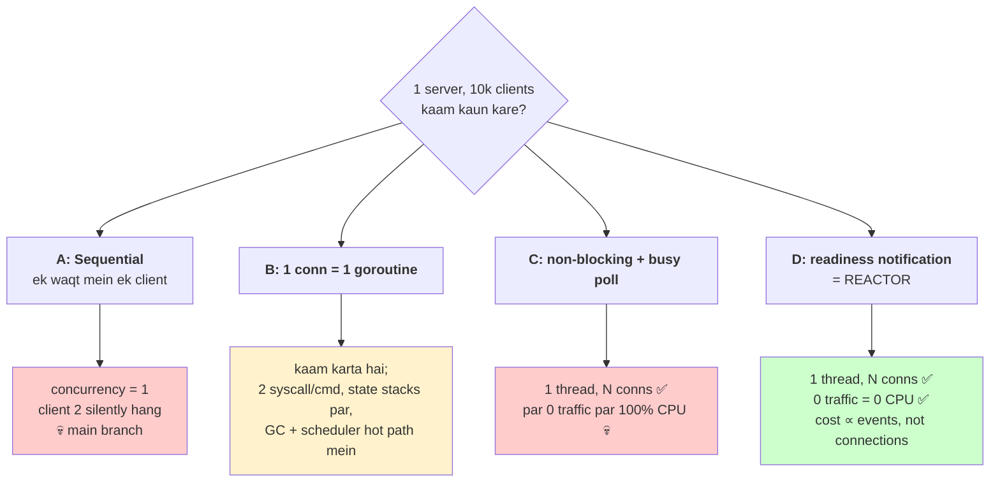
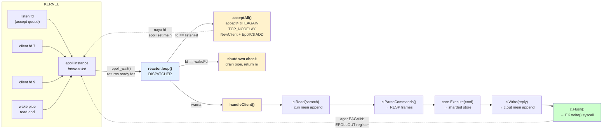

# Reactor Pattern — Ground Up

> Yeh doc sirf **ek** cheez ke baare mein hai: **reactor pattern**.
> Kya hai, kyu is project mein choose kiya, alternatives kya the, aur code mein
> exactly kahan-kahan baitha hai.
>
> Language: Hinglish + English technical terms. Har concept **code ke saath**.
> Har design choice ke saath do sawaal ka jawab: **kyu kiya** aur
> **agar yeh nahi karte to kya hota**.
>
> Chaar lens: **Code** · **Architecture** · **Performance** · **Interview**
>
> Progress: **Part 1 / 12 done**

## Roadmap

| Part | Kya cover hoga |
|---|---|
| **1** | Problem statement: 1 server, 10,000 client — chaar possible models, aur reactor kyu jeeta |
| 2 | `epoll` ground up: `select` → `poll` → `epoll`, level vs edge triggered |
| 3 | `reactor` struct ki anatomy — har field kyu hai |
| 4 | `newReactor()` line by line: socket → REUSEADDR → REUSEPORT → bind → listen → epoll_create1 → pipe2 |
| 5 | `reactor.loop()` line by line + EINTR bug (jo server ko maar deta tha) |
| 6 | `acceptAll()` line by line: EAGAIN, ECONNABORTED, TCP_NODELAY |
| 7 | `handleClient()` line by line: EPOLLIN/EPOLLOUT state machine, backpressure |
| 8 | `Client` struct: `in`/`out` buffers, `scratch`, reply coalescing |
| 9 | 1 reactor vs N reactors, `SO_REUSEPORT`, thundering herd, real benchmark numbers |
| 10 | Reactor vs shard — orthogonal hain (yeh sabse common confusion hai) |
| 11 | Alternatives se comparison: Redis 6 `io-threads`, Netty, nginx, DragonflyDB, Go `net/http` |
| 12 | Limitations (jo humne accept kiye) + Interview Q&A |

Reference code (hardening branch):
- [server/async_tcp.go](server/async_tcp.go) — reactor, 502 lines
- [server/client.go](server/client.go) — per-connection state, 195 lines

---

# Part 1 — Ek server, dus hazaar client. Kaam kaun karega?

## 1.1 Ground zero: socket read *rukta* hai

Sabse pehle yeh samjho, kyunki poora reactor pattern isi ek fact se paida hota hai:

```go
conn, _ := listener.Accept()     // (1) RUKO — jab tak koi client aaye
buf := make([]byte, 512)
n, _ := conn.Read(buf)           // (2) RUKO — jab tak client kuch bheje
```

Dono line **block** karti hain. Block ka matlab kya hota hai actually?

Kernel aapke thread ko `TASK_INTERRUPTIBLE` state mein daal deta hai aur CPU se
utha leta hai. Thread "sleeping" hai — CPU zero use kar raha hai. Jab data aata
hai, kernel usko `TASK_RUNNING` karta hai aur scheduler usko wapas CPU deta hai.

Yeh **efficient** hai (CPU waste nahi hota) par **exclusive** hai — woh thread us
ek fd ke intezaar mein atka hua hai. Doosre client ke liye woh kuch nahi kar
sakta.

Ek client ke liye perfect design. Problem sirf ek hai: **doosra client**.

## 1.2 Model A — Sequential (yeh literally `main` branch mein tha)

`main:server/sync_tcp.go`. Dhyaan se dekho — `go` statement **comment** kiya hua tha:

```go
for {
    c, err := lsnr.Accept()
    if err != nil { return err }

    for {                          // <-- read/respond loop INLINE, usi goroutine par
        cmd, err := readCmds(c)
        if err != nil { break }
        respond(c, cmd)
    }
    // go handle(c)                // 💀 yeh comment ho gaya tha
}
```

**Kya hota hai step by step:**

1. Client 1 connect hota hai → `Accept()` return karta hai
2. Andar wala `for` loop shuru — yeh loop client 1 disconnect hone tak chalta hai
3. Outer loop ka `Accept()` **kabhi** call nahi hota
4. Client 2 `connect()` karta hai → **kernel TCP handshake pura kar deta hai**
   (SYN, SYN-ACK, ACK) aur usko `listen()` backlog queue mein daal deta hai
5. Client 2 ke liye `connect()` **successfully return karta hai**
6. Client 2 `SET foo bar` bhejta hai... aur wait karta hai... forever

**Yeh sabse ganda failure mode hai jo ho sakta hai.** Client ko *lagta* hai ki woh
connected hai, kyunki TCP level par woh connected *hai*. Koi error nahi, koi
"connection refused" nahi. Sirf silent timeout. Debug karna nightmare hai.

- Concurrency: **1**
- Fix: neeche wale teen models mein se koi ek

## 1.3 Model B — Ek connection = ek thread / goroutine

Sabse obvious fix. Ek hi line ka change:

```go
for {
    c, _ := lsnr.Accept()
    go handleConn(c)     // <-- yeh ek line poora Model B hai
}
```

Ab har connection ka apna execution context hai. Woh block kare, koi farak nahi
padta — baaki goroutines chal rahi hain.

**Cost ka comparison — OS thread vs goroutine:**

| | OS thread (C, Java pre-21) | goroutine (Go) |
|---|---|---|
| Initial stack | 8 MB virtual (Linux default) | **8 KB**, demand par grow |
| 10,000 connections | 80 GB virtual, ~10k kernel schedulable entities | ~80 MB, Go scheduler ke andar |
| Context switch | ~1–2 µs, kernel mode transition | ~200 ns, pure userspace |
| Create/destroy | ~10–20 µs (`clone()`) | ~1 µs |

Isliye C mein Model B 10,000 connections par marta hai (C10K problem, 1999), par
**Go mein Model B genuinely viable hai**. Yeh galat design nahi hai.

**To phir Go mein reactor kyu?** Model B ki asli costs jo Go bhi fix nahi karta:

1. **Syscall count** — har command = minimum 1 `read()` + 1 `write()`. Do
   different connections ke replies ko ek syscall mein batch karne ka koi tareeka
   nahi, kyunki woh do alag goroutines par hain jo ek doosre ko jaanti nahi.
2. **State goroutine ke stack par chhup jaata hai** — `buf`, parse position, pending
   reply, sab local variables hain. Convenient, par server ke paas koi central view
   nahi: "kitne clients ka reply pending hai?" ka jawab dena impossible hai.
3. **GC ko 10,000 stacks scan karne padte hain** — stack scanning GC ke mark phase
   ka hissa hai. High connection count par yeh measurable ho jaata hai.
4. **Scheduler hot path mein aa jaata hai** — 10,000 runnable goroutines par tail
   latency (p99) scheduler ki fairness par depend karti hai, aapke code par nahi.
   Reactor mein hot path mein scheduler hi nahi hai.

> **Note:** hardening branch mein Model B **bhi maujood hai** —
> [server/sync_tcp.go](server/sync_tcp.go) mein `go` statement wapas add kiya gaya
> hai, as a working reference implementation. Dono models coexist karte hain; async
> wala default hai.

## 1.4 Model C — Non-blocking + busy loop (naive single-thread fix)

Socket ko non-blocking bana do. Ab `read()` block nahi karega — data nahi hai to
turant `EAGAIN` return kar dega:

```go
syscall.SetNonblock(fd, true)

for {
    for _, fd := range allFds {                  // 10,000 fds
        n, err := syscall.Read(fd, buf)
        if errors.Is(err, syscall.EAGAIN) {
            continue                              // "abhi kuch nahi hai"
        }
        process(fd, buf[:n])
    }
}
```

Technically yeh kaam karta hai: **ek thread, N connections**. Model A ka problem
solved, Model B ka memory cost bhi nahi.

**Par:**

- 10,000 fd × har outer iteration = **10,000 syscall**, jinme se 9,999 sirf
  `EAGAIN` return karte hain. Har syscall ~100–500 ns ka user→kernel transition hai.
- CPU **100% burn** hota hai jab traffic **zero** ho. Idle server aapke laptop ka
  fan chalu kar dega.
- Latency bhi kharab: ek fd ka data aane ke baad usko notice hone tak poora loop
  ghoomna padta hai.

Problem ka naam: **polling**. Hum kernel se baar-baar poochh rahe hain
"kuch hai? kuch hai? kuch hai?" — 9,999 baar jawab "nahi" hai.

Ulta socho: kernel ko **already pata hai** kis fd par data aaya. Woh interrupt
handler mein woh packet uske socket buffer mein daal chuka hai. Hum woh
information dobara khoj rahe hain jo kernel ke paas pehle se hai.

## 1.5 Model D — Kernel se poocho mat, **kernel se batwao**

Flip kar do. Ek syscall mein kernel ko **saare** fds ka interest register kar do,
phir so jao. Kernel jagayega jab kisi ek par kuch hoga — aur batayega **kis par**:

```go
// Ek baar: kernel ke andar ek "interest list" banao
epfd, _ := syscall.EpollCreate1(syscall.EPOLL_CLOEXEC)
syscall.EpollCtl(epfd, syscall.EPOLL_CTL_ADD, fd, &syscall.EpollEvent{
    Events: syscall.EPOLLIN,      // "mujhe batao jab yeh readable ho"
    Fd:     int32(fd),
})

// Hot loop: ek syscall, saare fds
for {
    n, _ := syscall.EpollWait(epfd, events, -1)   // -1 = anant tak so jao
    for i := 0; i < n; i++ {
        fd := int(events[i].Fd)                   // SIRF yeh fd ready hai
        process(fd)                               // yeh read() EAGAIN nahi dega
    }
}
```

Ab arithmetic dekho:

| Situation | Model C (busy poll) | Model D (epoll) |
|---|---|---|
| 0 traffic, 10k conns | 10,000 syscall/iteration, 100% CPU | **0 syscall**, thread sleeping, 0% CPU |
| 1 client active | 10,000 syscall to find 1 | 1 wakeup + 1 `read()` |
| 10,000 client active | 10,000 syscall | 1 wakeup + 10,000 `read()` |

Cost **actual events** ke proportional hai, **connection count** ke nahi. Yeh
poore design ka core insight hai.

**Is Model D ka naam hai: reactor pattern.**

## 1.6 Chaar models, ek nazar mein



## 1.7 Reactor pattern ki formal definition — teen hisse

Pattern ka naam Douglas Schmidt ne diya (1995). Teen components hote hain:

| # | Component | Kaam | Is codebase mein |
|---|---|---|---|
| 1 | **Demultiplexer** | Ek blocking call jo *bahut* fds ko watch karti hai | `syscall.EpollWait` (kernel ka kaam) |
| 2 | **Dispatcher / event loop** | Ready events dekho, decide karo kiska kaam hai | `reactor.loop()` — [async_tcp.go:296](server/async_tcp.go#L296) |
| 3 | **Handlers** | Per-fd actual kaam | `acceptAll()` listen fd ke liye, `handleClient()` client fd ke liye |

**"Reactor" naam kyu?** Kyunki code events par **react** karta hai. Aap kernel ko
nahi bolte "yeh karo aur mujhe rok ke rakho". Kernel aapko batata hai "yeh hua",
aur aap react karte hain. Yeh **inversion of control** hai — wahi cheez jo GUI
frameworks (`onClick`) aur JavaScript (`addEventListener`) mein hoti hai. Node.js
poora ek reactor hai (libuv). nginx bhi. Redis bhi (`ae.c` / `ae_epoll.c`).

Actual code mein teeno hisse ek jagah dikhte hain — `reactor.loop()`:

```go
func (r *reactor) loop() error {
    for {
        // (1) DEMULTIPLEXER — ek call, saare fds, so jao
        n, err := syscall.EpollWait(r.epfd, r.events, -1)
        if err != nil {
            if errors.Is(err, syscall.EINTR) { continue }   // Part 5 mein detail
            return fmt.Errorf("reactor %d: epoll_wait: %w", r.id, err)
        }

        // (2) DISPATCHER — kiska event hai?
        for i := 0; i < n; i++ {
            fd := int(r.events[i].Fd)
            ev := r.events[i].Events

            switch {
            case fd == r.wakeFd:                  // (3a) HANDLER: shutdown signal
                var b [8]byte
                syscall.Read(r.wakeFd, b[:])
                if r.srv.shuttingDown.Load() { return nil }

            case fd == r.listenFd:                // (3b) HANDLER: naya client
                r.acceptAll()

            default:                              // (3c) HANDLER: existing client
                r.handleClient(fd, ev)
            }
        }
    }
}
```

Poora server isi 20 line ke andar hai. Baaki sab iske handlers hain.

## 1.8 Poora data flow — ek diagram mein



Do dotted arrows important hain — woh **feedback loops** hain: handler khud epoll ki
interest list ko modify karta hai. Naya client add karna, ya "mujhe batao jab yeh
socket writable ho" — dono `EpollCtl` calls hain jo handler ke andar se hoti hain.

## 1.9 To phir *is* project mein reactor kyu — 5 concrete reasons

Model B (goroutine-per-conn) Go mein valid hai. Reactor phir bhi chuna, kyunki:

**1. epoll already likha hua tha, sirf adhoora tha.**
`main:server/async_tcp.go` mein epoll loop pehle se tha, do TODO ke saath:

```go
//todo
//assigne this new client to an seprate IO thread
...
///todo
//same I/O thread for read cmd
```

In dono TODO ka jawab hi reactor pattern hai. Model B pe switch karna in TODOs ko
*delete* karna hota, complete karna nahi.

**2. Redis parity.** Real Redis ek single-threaded reactor hai (`ae.c`,
`ae_epoll.c`). Agar goal Redis-compatible server hai, to uska concurrency model
match karna behaviour ko bhi match karta hai — command atomicity, ordering
guarantees, `SETNX`/`INCR` ka lock-free hona.

**3. Reply coalescing sirf reactor mein possible hai.** Ek connection ke saare
replies ek buffer (`c.out`) mein jama karke **ek** `write()` karna — yeh 240×–462×
pipelined throughput improvement ka poora mechanism hai. Model B mein har goroutine
apna `conn.Write()` karti hai; batching karne ke liye aapko *phir se* ek shared
buffer + owner concept chahiye — matlab aap reactor ko re-invent kar rahe ho.

**4. Backpressure explicitly handle kar sakte hain.** Jab kernel ka send buffer bhar
jaata hai, reactor mein aap `EPOLLOUT` register karke baaki bytes baad mein bhejte
ho, aur beech mein doosre clients serve karte rehte ho:

```go
if !done {
    // kernel buffer bhar gaya — writability ka interest register karo
    if err := r.mod(fd, syscall.EPOLLIN|syscall.EPOLLOUT); err != nil {
        r.drop(c); return
    }
}
```

Model B mein `conn.Write()` blocking hai — woh goroutine wahin ruk jaati hai. Theek
hai (baaki chal rahe hain) par aapke paas visibility ya control nahi hai.

**5. Predictable tail latency.** Reactor ke hot path mein Go scheduler bilkul nahi
hai — koi goroutine wakeup nahi, koi channel nahi, koi mutex nahi (per-connection
state par). Isi liye p50 latency **0.039 ms** measure hui.

## 1.10 "Agar reactor nahi karte to kya hota"

| Agar yeh nahi hota | To kya hota |
|---|---|
| Koi bhi concurrency model nahi (Model A) | Ek client at a time; client 2 ka `connect()` succeed hota par ek byte process nahi hota — silent hang |
| Reactor nahi, Model B chunte | Server chalta, par: per-connection reply batching gayab, `Client{in,out}` jaisa central state nahi, 240×–462× pipelined win nahi milta, `main` ke dono TODO delete hote |
| Reactor liya par non-blocking sockets nahi (`Accept4(fd, 0)`) | Ek slow client `read()` ke andar poora event loop wedge kar deta — **poori database ek client ki wajah se rukti** |
| Reactor liya par per-connection buffer nahi (`FDComm{Fd}` jaisa) | Do segment mein bata hua command garbage parse hota; pipeline ka trailing partial command chup-chaap kho jaata |
| Reactor liya par `EINTR` handle nahi kiya | Go runtime ka SIGURG preemption `epoll_wait` ko `EINTR` deta, code usko fatal maanta → **server milliseconds mein mar jaata**. `GODEBUG=asyncpreemptoff=1` yahi bug chhupa raha tha |
| Reactor liya par `EPOLLOUT` handle nahi kiya | Kernel send buffer bharne par reply ka baaki hissa chup-chaap drop hota → protocol stream desync → client permanently confused |

## 1.11 Chaar lens se Part 1

**Code POV.** Reactor 3 cheezein maangta hai jo Model B free deta hai:
non-blocking fds har jagah, ek explicit per-connection state struct
(`Client{in, out, closed}`), aur handlers jo *kabhi* block na karein. Teesra rule
sabse strict hai: reactor ke andar ek blocking call = poora server ruk gaya.
Isi liye `client.go` ka existence reactor model ka lagaan hai — woh state jo Model
B mein goroutine ke stack par invisible hoti hai, yahan explicitly likhni padti hai.

**Architecture POV.** Reactor pattern ka core trade hai: aap **kernel se poochhna
band karke kernel se batwate ho**, aur badle mein apna control flow inverted kar
lete ho. Har blocking operation ko ek state machine mein todna padta hai. Yeh
mehnga hai likhne mein, par isse aapko woh cheez milti hai jo Model B nahi de
sakta: **ek jagah, ek goroutine, jisko saare connections ka poora view hai.**
Batching, backpressure, fair scheduling — sab usi single view se possible hain.

**Performance POV.** Ek line mein: **cost ∝ events, not connections.** 10,000 idle
connections ka cost 0 CPU hai. Aur kyunki ek goroutine ek batch ke saare events
handle karti hai, aap syscalls ko amortize kar sakte ho — ek `epoll_wait` se 1024
events, aur per-connection ek `write()` chahe 64 commands ka pipeline ho.

**Interview POV.** Yeh exact question hai: *"How would you build a server that
handles 10,000 concurrent connections?"* Sahi jawab yeh **nahi** hai ki "epoll use
karunga". Sahi jawab yeh hai:

> "Pehle poochhta hoon workload kaisa hai. Agar per-connection kaam CPU-heavy ya
> blocking-IO-heavy hai, to thread/goroutine-per-connection better hai — code simple
> rehta hai aur ab goroutines sasti hain. Agar kaam chhota hai aur bottleneck
> syscall overhead hai — jaise ek in-memory KV store — to reactor pattern jeetta
> hai, kyunki tab main batching aur backpressure control kar sakta hoon.
> C10K ka asli lesson yeh nahi tha ki 'threads bure hain', lesson yeh tha ki
> **per-connection cost O(1) hona chahiye, per-poll cost O(active) hona chahiye** —
> aur `select`/`poll` ka O(n) scan hi asli problem tha, threads nahi."

Follow-up jo zaroor aayega: *"epoll level-triggered hai ya edge-triggered? Aap
kaunsa use kar rahe ho aur kyu?"* — woh **Part 2** hai.

---

`next` bolo to **Part 2 — epoll ground up (`select` → `poll` → `epoll`, level vs
edge triggered)** likhta hoon.

