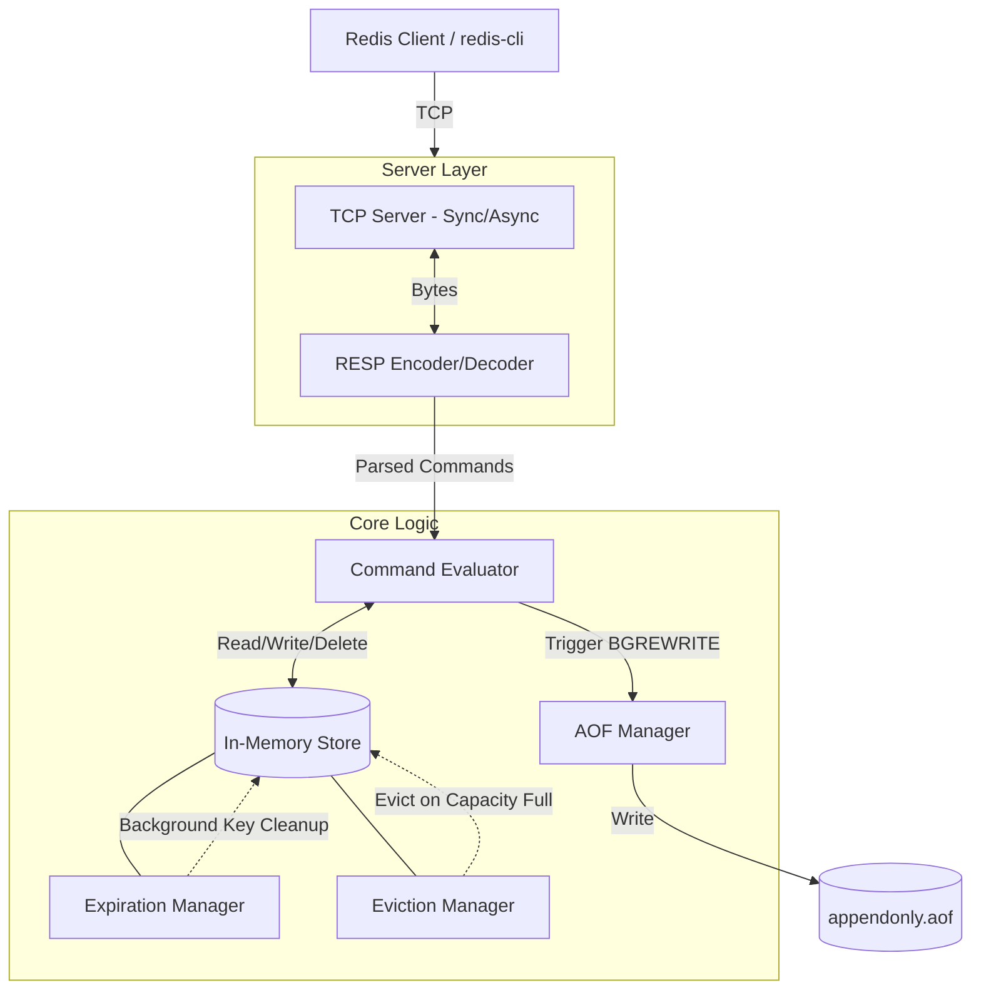

# Redis-Go

A lightweight, concurrent, and fast in-memory key-value data store written in Go, inspired by Redis. 

## Features

- **Custom TCP Server:** Supports both Asynchronous (non-blocking) and Synchronous TCP connection handling.
- **RESP Protocol:** Implements custom parsing for the REdis Serialization Protocol (RESP), ensuring compatibility with standard Redis clients (e.g., `redis-cli`).
- **In-Memory Storage:** Fast key-value hash map storage.
- **Key Expiration (TTL):** Active and passive background expiry mechanism (probabilistic deletion similar to Redis).
- **Eviction Policies:** Simple max-key limit handling to prevent Out-Of-Memory scenarios.
- **Persistence:** Append-Only File (AOF) background rewrites to persist data onto disk (`appendonly.aof`).

## Architecture

The architecture comprises modular layers to handle connections, parse commands, manipulate data, and persist state.



## Supported Commands

- `PING` - Test connection.
- `SET <key> <value>` - Set the string value of a key.
- `GET <key>` - Get the value of a key.
- `TTL <key>` - Get the time to live for a key.
- `DEL <key>` - Delete a key.
- `COMMAND` - Command documentation stub.
- `BGREWRITE` - Triggers an asynchronous dump of the current database to the AOF file.

## Getting Started

### Run the server
```bash
# Uses default host 0.0.0.0 and port 7379
go run main.go
```

### Options
```bash
go run main.go --host 127.0.0.1 --port 6379
```

### Connect with Redis CLI
```bash
redis-cli -h 127.0.0.1 -p 7379
```
