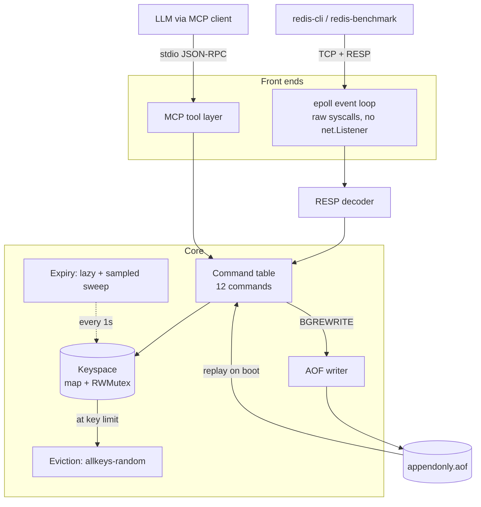

# redis-go

An in-memory key–value store written from scratch in Go, speaking the real
Redis wire protocol.

It does not use `net.Listener`. Connections are accepted and read through raw
Linux `epoll` syscalls on a single event-loop goroutine, which is the same
concurrency model Redis itself uses. `redis-cli` and `redis-benchmark` talk to
it unmodified.

It also runs as an [MCP](https://modelcontextprotocol.io) server, so an LLM can
read and write the same keyspace through tools instead of a socket.

---

## Benchmarks

Measured with `redis-benchmark`, 50 concurrent clients, 100,000 requests, three
runs, against a real `redis-server` on the same idle machine with identical
client settings.

| | redis-go | redis-server 8.8.0 | ratio |
|---|---:|---:|---:|
| SET throughput | 132,755 ops/sec | 140,059 ops/sec | 94.8% |
| GET throughput | 134,069 ops/sec | 140,483 ops/sec | 95.4% |
| SET p50 latency | 0.183 ms | 0.180 ms | — |
| GET p50 latency | 0.183 ms | 0.178 ms | — |

Both servers ran with persistence disabled, so neither pays for background
writes during the measurement.

Reproduce it yourself:

```bash
./bench/bench.sh --compare
```

The script builds the server, runs it on a scratch port and scratch directory,
warms it up, then reports three runs against both servers. Numbers depend on
your hardware; the ratio is the meaningful figure.

Both servers were driven by the default single-threaded `redis-benchmark`
client, which is itself a bottleneck at this rate — these figures compare the
two servers against each other, not against a hardware ceiling.

---

## Quick start

```bash
go build -o redisgo .
./redisgo --port 7379
```

```bash
redis-cli -p 7379
```

```
127.0.0.1:7379> SET user:1 alice
OK
127.0.0.1:7379> GET user:1
"alice"
127.0.0.1:7379> SET session:1 token EX 60
OK
127.0.0.1:7379> TTL session:1
(integer) 60
127.0.0.1:7379> INCR visits
(integer) 1
127.0.0.1:7379> TYPE visits
string
```

### Flags

| Flag | Default | Meaning |
|---|---|---|
| `--host` | `0.0.0.0` | Address to bind |
| `--port` | `7378` | Port to listen on |
| `--keylimit` | `100000` | Key count at which eviction starts |
| `--aof` | `appendonly.aof` | Append-only file used for persistence |
| `--mcp` | off | Also serve MCP tools over stdio |
| `--pprof` | off | Serve `net/http/pprof`, e.g. `--pprof localhost:6060` |

---

## Commands

Twelve commands, all dispatched through one table in
[`core/cmd.go`](core/cmd.go).

| Command | Behaviour |
|---|---|
| `PING [message]` | Liveness check; echoes `message` when given |
| `SET key value [EX seconds]` | Store a string, optionally with a TTL |
| `GET key` | Read a string, `(nil)` when absent or expired |
| `DEL key [key ...]` | Delete keys, returns how many were removed |
| `EXISTS key [key ...]` | Count how many of the keys are present |
| `EXPIRE key seconds` | Attach a TTL to an existing key |
| `TTL key` | Seconds remaining; `-1` no expiry, `-2` no key |
| `TYPE key` | Stored type, read out of the packed object header |
| `INCR key` | Atomic increment, creating the key at `0` |
| `DECR key` | Atomic decrement |
| `COMMAND` | List the supported command names |
| `BGREWRITE` | Snapshot the keyspace to the AOF in the background |

---

## MCP: the store as an agent tool

```bash
./redisgo --mcp --port 7379
```

The RESP listener keeps running alongside the stdio server, so `redis-cli` and a
model operate on the same live keyspace.

Eight tools are exposed: `redis_set`, `redis_get`, `redis_del`, `redis_exists`,
`redis_expire`, `redis_ttl`, `redis_type`, `redis_incr`.

Register it with any MCP client:

```json
{
  "mcpServers": {
    "redis-go": {
      "command": "/absolute/path/to/redisgo",
      "args": ["--mcp"]
    }
  }
}
```

The bridge in [`server/mcp.go`](server/mcp.go) does not reimplement anything. It
builds a `RedisCmd`, hands it to the same `EvalAndRespond` the TCP server calls,
and decodes the RESP bytes that come back. A key written by a model therefore
goes through identical argument validation, TTL handling, eviction, keyspace
accounting and AOF persistence as one written by `redis-cli` — there is no
second, less-careful path into the store.

Errors cross that boundary properly too. A `-ERR ...` frame decodes to a Go
`error` value, and the tool layer turns it into an MCP error rather than a
successful result whose text happens to describe a failure:

```
redis_set  {"key":"txt","value":"hello"}  ->  OK
redis_incr {"key":"txt"}                  ->  isError: true
                                              "ERR value is not an integer or out of range"
```

---

## Architecture


```mermaid
graph TD
    CLI[redis-cli / redis-benchmark] -->|TCP + RESP| Loop
    LLM[LLM via MCP client] -->|stdio JSON-RPC| MCP[MCP tool layer]

    subgraph Front[Front ends]
        Loop[epoll event loop<br/>raw syscalls, no net.Listener]
        MCP
    end

    Loop --> Decode[RESP decoder]
    Decode --> Table
    MCP --> Table

    subgraph Core[Core]
        Table[Command table<br/>12 commands]
        Store[(Keyspace<br/>map + RWMutex)]
        Expiry[Expiry: lazy + sampled sweep]
        Evict[Eviction: allkeys-random]
        AOF[AOF writer]
    end

    Table --> Store
    Expiry -.->|every 1s| Store
    Store -->|at key limit| Evict
    Table -->|BGREWRITE| AOF
    AOF --> Disk[(appendonly.aof)]
    Disk -->|replay on boot| Table
```

**The event loop.** `RunAsyncTCP` creates a non-blocking socket with
`syscall.Socket`, registers it with `epoll_create1`/`epoll_ctl`, and blocks in
`epoll_wait`. Ready descriptors are read through `FDComm`, a thin
`io.ReadWriter` over `syscall.Read`/`syscall.Write`, so replies go to the socket
with no `net.Conn` allocation in the hot path. The backlog and event buffer are
both sized for 20,000 connections.

**Typed objects.** Every value carries a single `uint8` header packing the type
in the high nibble and the encoding in the low nibble, so an object costs one
byte of metadata rather than two fields. Integers are stored as `int`,
strings under 44 bytes as `embstr`, longer ones as `raw` — the same thresholds
Redis uses. `TYPE` reads straight out of that byte.

**Expiry, both halves.** Reads drop expired keys lazily. That alone leaks keys
nobody reads again, so a background goroutine samples 20 random keys a second
and deletes the expired ones; if more than 25% of a sample was expired it
samples again, up to 16 rounds. Bounded work per tick keeps the sweep from
stalling the event loop.

**Eviction.** Once the keyspace hits `--keylimit`, `allkeys-random` drops a
fraction of it, relying on Go's randomised map iteration order.

**Persistence.** `BGREWRITE` snapshots the keyspace to the AOF on a background
goroutine. Keys are written as the `SET` that recreates them, TTLs included, and
replayed through the same command table on boot.

---

## Tests

```bash
go test ./...
go test ./... -race
```

The RESP decoder is covered two ways. Table-driven tests in
[`core/resp_test.go`](core/resp_test.go) pin every frame type, the encode/decode
round trip, and a list of malformed frames. Fuzz targets in
[`core/resp_fuzz_test.go`](core/resp_fuzz_test.go) assert the weaker but
absolute property that no input at all can panic the decoder:

```bash
go test ./core/ -run=FuzzDecode -fuzz='FuzzDecode$' -fuzztime=60s
```

That matters because the decoder sits directly behind a socket on a
single-threaded loop — one panic is not one bad request, it is the whole server.

The rest of the suite covers the twelve commands against raw wire bytes, lazy
and active expiry, eviction under the key limit, concurrent `INCR` under
`-race`, and an AOF dump/wipe/reload round trip.

---

## Issues this project hit, and how they were fixed

Each of these was a real defect found by writing the tests and benchmarks above.

**The decoder could be crashed by a 20-byte packet.** `readBulkString` trusted
the declared length and sliced `data[pos : pos+length]` without checking it
against the buffer. Fuzzing found three panicking inputs — `$5\r\nab`,
`$5\r\n`, and `$999999999999999\r\nx\r\n`, the last of which tries to slice a
petabyte — plus nine more malformed frames that were silently accepted as valid.
All length prefixes are now bounds-checked, capped at Redis' 512 MB limit, and
array headers refuse to preallocate for more elements than the remaining bytes
could hold.

**The server died at random under load.** `epoll_wait` returns `EINTR` whenever a
signal arrives, and the Go runtime preempts goroutines by delivering `SIGURG`.
The loop treated any error as fatal and returned, so the process exited
mid-benchmark. `EINTR` is now retried, in the event loop and in the socket
read/write path.

**Crossing the key limit deadlocked the server permanently.** `Put` took the
store's write lock and then called `evict`, which reclaimed keys through `Del` —
which takes that same non-reentrant mutex. Any workload touching more than
`--keylimit` distinct keys wedged the event-loop goroutine and hung every
connected client at once. Eviction now deletes under the lock the caller already
holds. `TestEvictionDoesNotDeadlock` fails against the old code.

**`--host` and `--port` were silently ignored.** The listen address was built in
a package-level variable, which Go initialises before `main` calls
`flag.Parse()`, so the server always bound the compiled-in default no matter
what was passed. The address is now resolved inside `RunAsyncTCP`.

**Protocol errors reached the model as successes.** The MCP bridge decoded a
`-ERR ...` reply like any other value and returned it as tool output, so a model
issuing an invalid command read the error text as a result and carried on.
Error frames now decode to a Go `error` and surface as MCP errors.

**A malformed frame could panic the connection handler.** `readCmds` type-asserted
decoded values to `string` unchecked, so a client sending a nested array or an
integer where a command name belonged crashed the event loop. The assertions are
checked and such frames are rejected.

**Increments could be lost.** `INCR` read the object under one lock, then mutated
it outside any lock. Single-threaded RESP traffic never exposed this, but under
`--mcp` the event loop and the stdio server drive commands from two goroutines
against one map. The read-modify-write now happens inside a single write lock,
with overflow detection.

**Smaller ones.** The active-expiry sweep divided by its remaining budget rather
than the sample size, so its ratio did not mean what the 0.25 threshold assumed.
The AOF built commands with `fmt.Sprintf` and split on spaces, corrupting any
value containing a space, and dropped TTLs entirely. `pprof` bound port 6060
unconditionally. Around 37 MB of compiled binaries and logs were tracked in git.

---

## Limitations

Worth knowing before reading the code as production-grade:

- **Strings only.** No lists, hashes, sets or sorted sets. The object header has
  room for them; the commands do not exist.
- **One read buffer per event, 512 bytes.** A command larger than that, or split
  across TCP segments, is rejected rather than buffered until complete. Deep
  pipelining beyond one buffer is not supported.
- **Single-threaded execution.** All commands run on the event-loop goroutine.
  That is deliberate and matches Redis, but there is no I/O threading.
- **AOF is snapshot-only.** `BGREWRITE` dumps the whole keyspace on demand;
  writes are not appended as they happen, so an unclean shutdown loses
  everything since the last rewrite.
- **No replication, clustering, auth or TLS.**
