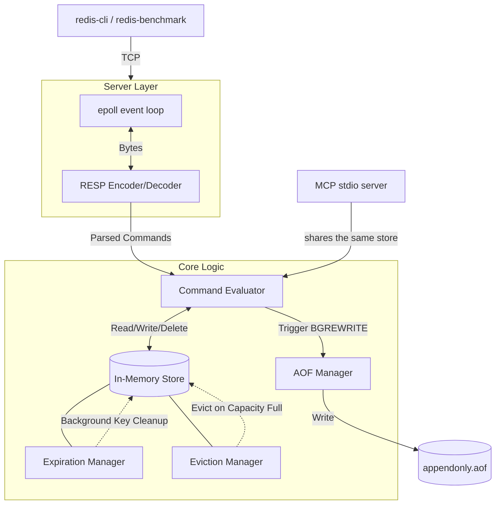

# Redis-Go

A lightweight, concurrent in-memory key-value store written in Go, inspired by Redis. Built from scratch on raw `epoll` syscalls — no `net.Listener` in the hot path, no third-party server framework.

This is a learning-and-benchmarking project. The goal is not feature parity with Redis; it is to understand *why* Redis is fast by rebuilding its core mechanisms and measuring the result against the real thing.

## Features

- **Raw epoll event loop** — non-blocking single-threaded server built directly on `syscall.EpollWait`, modelled on Redis's own reactor design. A synchronous `net.Conn` implementation is also included for comparison.
- **RESP protocol** — hand-written encoder/decoder for the REdis Serialization Protocol, compatible with standard clients (`redis-cli`, `redis-benchmark`). Supports simple strings, errors, integers, bulk strings, nested arrays, **inline commands**, and **pipelining**.
- **Typed object system** — type and encoding are bit-packed into a single `uint8` (upper 4 bits type, lower 4 encoding), mirroring Redis's `robj`. Strings auto-select `INT` / `EMBSTR` (≤44 bytes) / `RAW` encoding.
- **Key expiration (TTL)** — lazy deletion on read plus a background probabilistic sampling sweep, the same two-pronged strategy Redis uses.
- **Eviction** — configurable max-key limit with `allkeys-random` policy.
- **Persistence** — append-only file that is replayed on startup to restore the keyspace.
- **MCP server** — exposes the store as tools to an LLM over stdio via the Model Context Protocol. See [MCP.md](MCP.md).
- **Profiling** — `net/http/pprof` served on `:6060`.

## Architecture


```mermaid
graph TD
    Client[redis-cli / redis-benchmark] -->|TCP| ServerLayer

    subgraph ServerLayer [Server Layer]
        Server[epoll event loop]
        RESP[RESP Encoder/Decoder]
    end

    Server <-->|Bytes| RESP
    RESP -->|Parsed Commands| Evaluator

    subgraph CoreLogic [Core Logic]
        Evaluator[Command Evaluator]
        Store[(In-Memory Store)]
        ExpManager[Expiration Manager]
        EvicManager[Eviction Manager]
        AOF[AOF Manager]
    end

    Evaluator <-->|Read/Write/Delete| Store
    Store --- ExpManager
    Store --- EvicManager
    Evaluator -->|Trigger BGREWRITE| AOF
    AOF -->|Write| Disk[(appendonly.aof)]

    ExpManager -.->|Background Key Cleanup| Store
    EvicManager -.->|Evict on Capacity Full| Store

    MCP[MCP stdio server] -->|shares the same store| Evaluator
```

## Supported Commands

| Command | Notes |
|---|---|
| `PING [message]` | Test connection |
| `SET <key> <value> [EX seconds]` | Set a string value. Only the `EX` option is implemented — `PX`/`NX`/`XX`/`KEEPTTL` are not yet supported |
| `GET <key>` | Get the value of a key |
| `INCR <key>` | Increment an integer value by 1 |
| `TTL <key>` | Seconds remaining (`-1` no expiry, `-2` missing/expired) |
| `DEL <key> [key ...]` | Delete keys, returns the count deleted |
| `COMMAND` | Stub — returns `+OK`, does not return real command metadata |
| `BGREWRITE` | Dump the current keyspace to the AOF file asynchronously |

Anything else returns `ERR unknown command`.

## Benchmarks

Measured against real Redis on identical hardware and flags.

**Environment:** Go 1.26.4, Linux 7.0.0-30-generic, 8 CPU, 14 GiB RAM, Redis 8.8.0 (jemalloc), loopback.
**Command:** `redis-benchmark -t set,get -n 10000 -c 10 [-P <depth>] -q`

| Workload | Redis-Go | Redis 8.8.0 | Ratio |
|---|---:|---:|---:|
| `SET`, no pipelining | **103,093** rps · p50 0.071 ms | 108,696 rps · p50 0.055 ms | **0.95×** |
| `GET`, no pipelining | **125,000** rps · p50 0.063 ms | 135,135 rps · p50 0.047 ms | **0.93×** |
| `SET`, pipelined `-P 8` | 1,952 rps · p50 0.175 ms | 666,667 rps · p50 0.103 ms | 0.003× (341× slower) |
| `GET`, pipelined `-P 8` | 1,954 rps · p50 0.335 ms | 714,286 rps · p50 0.087 ms | 0.003× (366× slower) |

Two things worth reading twice:

**Unpipelined throughput is within 5–7% of real Redis.** For a from-scratch implementation that is a genuinely good result, and it validates the epoll + hand-rolled RESP approach.

**Pipelined throughput collapses.** Round-trip latency is a flat **~41 ms** at every pipeline depth from 2 to 16 — a signature of the Nagle / delayed-ACK interaction, not of parsing cost:

| Pipeline depth | 1 | 2 | 3 | 4 | 8 | 16 |
|---|---:|---:|---:|---:|---:|---:|
| Median RTT | 0.13 ms | 41.02 ms | 41.02 ms | 41.11 ms | 41.06 ms | 41.05 ms |

The server issues one `write()` syscall per reply and never sets `TCP_NODELAY` on accepted sockets, so Nagle holds the second and subsequent small writes until the client's delayed ACK fires 40 ms later. This is the single largest known performance defect and is tracked as task 1.7 in [ROADMAP.md](ROADMAP.md).

> **Reproducibility caveat:** these numbers were collected with `GODEBUG=asyncpreemptoff=1`. Without it the server exits within 14–40 commands — see Known Issues below.

## Known Issues

This project is mid-rebuild. These are reproduced and tracked, not speculative:

| # | Issue | Impact |
|---|---|---|
| 1 | `EpollWait` treats `EINTR` as fatal, so the server exits when Go's runtime delivers a preemption signal (`SIGURG`) | **Server dies within seconds of use.** Proven: 3/3 runs died at 14/38/40 commands; with `GODEBUG=asyncpreemptoff=1`, 150 commands with zero failures |
| 2 | Nagle / delayed-ACK stall | Flat 41 ms RTT on any pipelined workload; 341–366× slower than Redis at `-P 8` |
| 3 | Eviction deadlock: `Put` holds the write lock and calls `Del`, which re-acquires it. Go's `RWMutex` is not reentrant | **Server hangs permanently** on the 201st key (`KeyLimit` = 200). Reproduced exactly at key 200, confirmed by pprof goroutine dump |
| 4 | Root package does not compile — a stray 9.3 MB ELF binary named `redis.go` is treated as a source file | `go build .`, `go run .`, and `go build ./...` all fail with `illegal character U+007F` |
| 5 | `--host` and `--port` flags have no effect on the epoll server | `serverSockaddr` is a package-level var initialised before `flag.Parse()` runs |
| 6 | Bind address is always `0.0.0.0` | `net.ParseIP` returns a 16-byte slice for IPv4; the code reads `ipv4[0..3]`, which is always `[0,0,0,0]`. Missing `To4()` |
| 7 | `INCR` mutates the stored object outside the lock | Data race, live under `--mcp` where two goroutines share the store |
| 8 | `Get` takes the write lock instead of `RLock` | No read concurrency |
| 9 | AOF is a manual snapshot, not an append log; TTLs are not persisted | Nothing written unless `BGREWRITE` is called explicitly; all expiry is lost across restarts |
| 10 | 512-byte read buffer, no partial-read handling | Assumes one epoll event delivers exactly one complete command |

## Getting Started

> **Note:** because of Known Issue 4, the root package does not currently build. Until that is resolved, use the checked-in `server_bin`, and build only the library packages:
>
> ```bash
> go build ./core/... ./server/... ./config/...
> ```

### Run the server

```bash
GODEBUG=asyncpreemptoff=1 ./server_bin
```

Listens on `0.0.0.0:7378`. `GODEBUG=asyncpreemptoff=1` is a temporary workaround for Known Issue 1.

### Connect

```bash
redis-cli -p 7378
```

### Run as an MCP server

```bash
./server_bin --mcp
```

Serves MCP over stdio while the TCP server runs concurrently. See [MCP.md](MCP.md).

### Profiling

```bash
go tool pprof http://localhost:6060/debug/pprof/profile?seconds=10
```

## Project Documentation

- **[ROADMAP.md](ROADMAP.md)** — phased task list with success criteria
- **[CONCURRENCY.md](CONCURRENCY.md)** — Go concurrency walkthrough keyed to this codebase
- **[MCP.md](MCP.md)** — how the MCP bridge works and what it reveals about the store's thread safety
